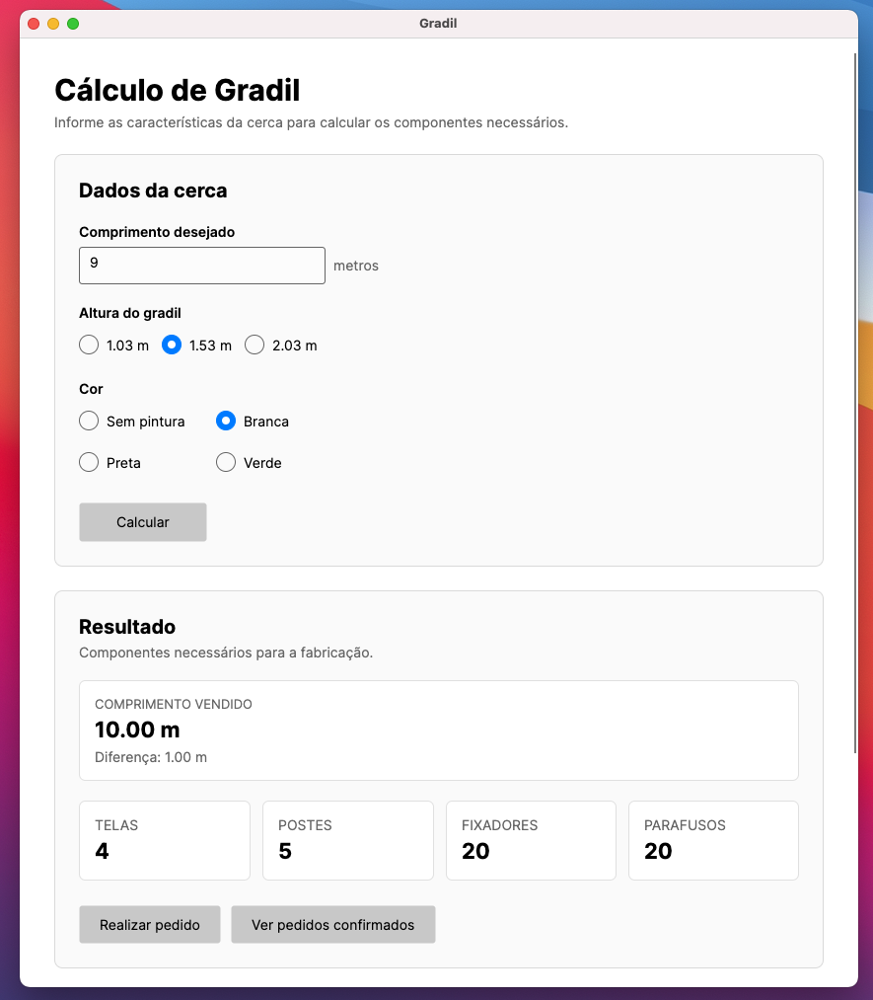
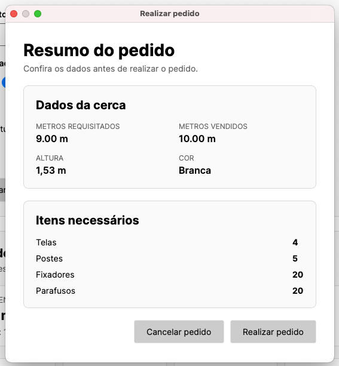
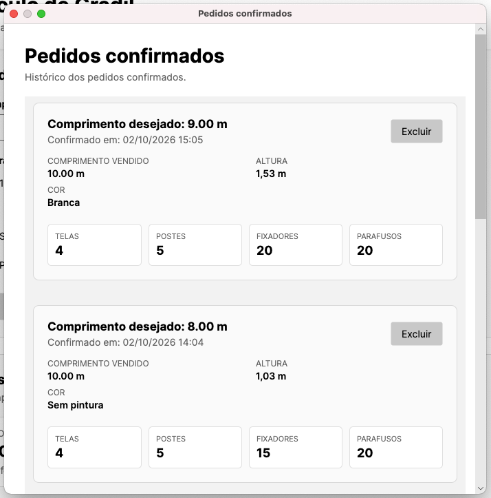

# GradilApp

Aplicação desktop desenvolvida em C# para configuração, cálculo e registro de
pedidos de gradil.

O projeto foi desenvolvido como exercício técnico, utilizando **.NET 6,
Avalonia UI e o padrão MVVM**, com separação entre interface, regras de negócio,
modelos e serviços.

---

## Funcionalidades

- Configuração do gradil a partir do comprimento, altura e cor.
- Cálculo dos módulos necessários para o comprimento informado.
- Cálculo dos componentes necessários para a montagem.
- Apresentação do resultado do cálculo na tela principal.
- Revisão e confirmação do pedido.
- Registro dos pedidos confirmados.
- Consulta dos pedidos registrados.

---

## Demonstração

### 1. Configuração e cálculo do gradil



Na tela principal, o usuário informa os dados necessários para configurar o
gradil, incluindo o comprimento, a altura e a cor.

A partir dessas informações, a aplicação realiza os cálculos necessários e
apresenta o resultado dos componentes utilizados na composição do gradil.

A lógica responsável pelos cálculos está separada da interface e concentrada
no serviço `CalculadoraGradilService`.

---

### 2. Confirmação do pedido



Após a configuração e o cálculo do gradil, o usuário pode revisar as
informações apresentadas e confirmar o pedido.

A confirmação permite registrar a configuração realizada para posterior
consulta.

---

### 3. Pedidos confirmados



Os pedidos confirmados ficam disponíveis na tela de pedidos, permitindo
consultar as configurações que já foram registradas durante a utilização
da aplicação.

O gerenciamento dos pedidos é realizado por meio do `PedidoService`,
mantendo essa responsabilidade separada da camada de apresentação.

---

## Tecnologias

- **C#**
- **.NET 6**
- **Avalonia UI 11.3.0**
- **CommunityToolkit.Mvvm 8.4.2**
- **XAML**
- **MVVM**

---

## Arquitetura

O projeto utiliza o padrão **MVVM (Model-View-ViewModel)** para separar as
responsabilidades da aplicação.

### Model

Responsável pela representação dos dados e entidades utilizadas pela aplicação.

Exemplos:

- `Gradil`
- `Pedido`
- `AlturaGradil`
- `CorGradil`
- `ComponentesGradil`

### View

Responsável pela interface gráfica da aplicação, desenvolvida utilizando
XAML e Avalonia.

As principais telas são:

- `MainWindow`
- `ConfirmacaoPedidoWindow`
- `PedidosWindow`

### ViewModel

Responsável pelo estado da interface, interação com os comandos e comunicação
entre a View e as demais camadas.

Exemplos:

- `MainViewModel`
- `ModuloGradilViewModel`
- `ViewModelBase`

### Services

Concentra responsabilidades relacionadas às regras da aplicação.

- `CalculadoraGradilService`: responsável pelos cálculos dos componentes
  necessários para o gradil.
- `PedidoService`: responsável pelo gerenciamento dos pedidos.

### Commands

Contém a implementação dos comandos utilizados para realizar ações a partir
da interface.

---

## Estrutura do projeto

```text
GradilApp/
│
├── Assets/
│   └── avalonia-logo.ico
│
├── Commands/
│   └── RelayCommands.cs
│
├── Models/
│   ├── AlturaGradil.cs
│   ├── ComponentesGradil.cs
│   ├── CorGradil.cs
│   ├── Gradil.cs
│   └── Pedido.cs
│
├── Services/
│   ├── CalculadoraGradilService.cs
│   └── PedidoService.cs
│
├── ViewModels/
│   ├── MainViewModel.cs
│   ├── ModuloGradilViewModel.cs
│   └── ViewModelBase.cs
│
├── Views/
│   ├── ConfirmacaoPedidoWindow.axaml
│   ├── ConfirmacaoPedidoWindow.axaml.cs
│   ├── MainWindow.axaml
│   ├── MainWindow.axaml.cs
│   ├── PedidosWindow.axaml
│   └── PedidosWindow.axaml.cs
│
├── App.axaml
├── App.axaml.cs
├── GradilApp.csproj
├── Program.cs
├── ViewLocator.cs
└── app.manifest
```
---

## Execução

### Requisitos

- .NET 6 SDK
- Sistema operacional compatível com .NET 6 e Avalonia

### Clone o repositório:

```bash
git clone https://github.com/Luis-Hang/GradilApp.git
```

### Entre no diretório:

```bash
cd GradilApp
```

### Restaure as dependências:

```bash
dotnet restore
```

### Compilar

```bash
dotnet build
```

### Executar

```bash
dotnet run
```

## Publicação para Windows

Para gerar uma versão self-contained para Windows:

```bash
dotnet publish -c Release -r win-x64 --self-contained true
```

O executável será gerado em:

```text
bin/Release/net6.0/win-x64/publish/
```

## Versão Windows

Uma versão publicada para **Windows x64** está disponível na seção **Releases** deste repositório.

A publicação utiliza o modo **self-contained**, incluindo o runtime necessário para execução da aplicação.

Dessa forma, o usuário não precisa instalar separadamente o .NET Runtime para executar a versão publicada.

### Execução

Após baixar o pacote da versão Windows:

1. Extraia o arquivo `.zip`.
2. Abra a pasta extraída.
3. Execute `GradilApp.exe`.

> A versão publicada é destinada a sistemas Windows x64.

## Repositório

[GitHub - GradilApp](https://github.com/Luis-Hang/GradilApp)

## Autor

**Luis Gustavo Hang Pereira**

Engenharia Elétrica – UFSC  
Desenvolvedor de Software

[LinkedIn](https://br.linkedin.com/in/luis-gustavo-hang-pereira-3663521b)